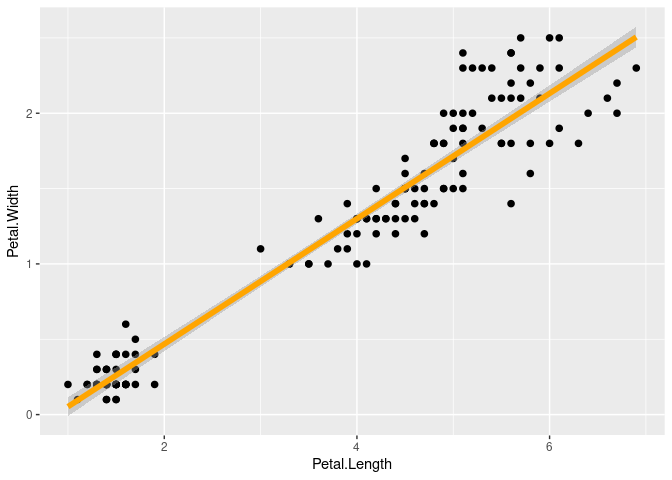
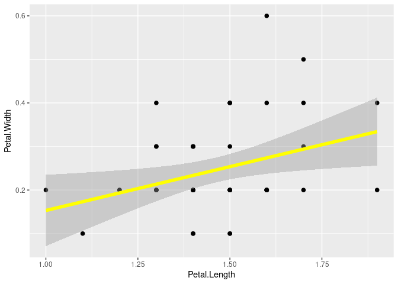

Lab 7 / Lab Practical
================
2021-05-04

Fill out this report and submit it as your completed assignment.

You can view the R markdown script that created this report here:
[README.Rmd](README.Rmd)

``` r
library(tidyverse)
```

    ## ── Attaching packages ─────────────────────────────────────── tidyverse 1.3.1 ──

    ## ✓ ggplot2 3.3.3     ✓ purrr   0.3.4
    ## ✓ tibble  3.1.1     ✓ dplyr   1.0.5
    ## ✓ tidyr   1.1.3     ✓ stringr 1.4.0
    ## ✓ readr   1.4.0     ✓ forcats 0.5.1

    ## ── Conflicts ────────────────────────────────────────── tidyverse_conflicts() ──
    ## x dplyr::filter() masks stats::filter()
    ## x dplyr::lag()    masks stats::lag()

``` r
library(palmerpenguins)
library(ggplot2)
```

Use the iris dataset in R to answer the following question:

``` r
iris
```

> **How are petal width and petal length related in irises?**
>
> Create a scatterplot showing the two variables and add a regression
> line. Use petal length as the explantory variable and petal width as
> the response variable.

``` r
ggplot(data = iris, aes(x = Petal.Length, y = Petal.Width)) +
  geom_point(size = 2) +
  geom_smooth(method = "lm", size = 2, color = "orange")
```

    ## `geom_smooth()` using formula 'y ~ x'

<!-- -->

> Calculate the correlation between the two variables.

``` r
cor(iris$Petal.Width, iris$Petal.Length, use = "complete.obs")
```

    ## [1] 0.9628654

> Estimate the parameters of the linear regression. What is the slope?

ANSWER

``` r
lm_pl_pw<-
  lm(Petal.Width~ Petal.Length, data = iris)
summary(lm_pl_pw)
```

    ## 
    ## Call:
    ## lm(formula = Petal.Width ~ Petal.Length, data = iris)
    ## 
    ## Residuals:
    ##      Min       1Q   Median       3Q      Max 
    ## -0.56515 -0.12358 -0.01898  0.13288  0.64272 
    ## 
    ## Coefficients:
    ##               Estimate Std. Error t value Pr(>|t|)    
    ## (Intercept)  -0.363076   0.039762  -9.131  4.7e-16 ***
    ## Petal.Length  0.415755   0.009582  43.387  < 2e-16 ***
    ## ---
    ## Signif. codes:  0 '***' 0.001 '**' 0.01 '*' 0.05 '.' 0.1 ' ' 1
    ## 
    ## Residual standard error: 0.2065 on 148 degrees of freedom
    ## Multiple R-squared:  0.9271, Adjusted R-squared:  0.9266 
    ## F-statistic:  1882 on 1 and 148 DF,  p-value: < 2.2e-16

The Y-intercept and slope can be found under the heading Coefficients.
They are -0.363076 and 0.415755, respectively. That means that for every
1 unit increase in petal length, there is a corresponding 0.4 unit
increase in petal width.

> Is the slope significantly different from zero?

ANSWER The P-value is near zero, much less than an alpha value of 0.05,
so yes the slope is significantly different from zero.

> Choose one species of your choice and fit the same linear model to the
> data for that species only. Which species did you choose? What is the
> slope? What is the correlation coefficient? Create a graph with
> scatterplot and linear regression line.

ANSWERS

``` r
i1<- filter(iris, Species == "setosa")
i1
```

    ##    Sepal.Length Sepal.Width Petal.Length Petal.Width Species
    ## 1           5.1         3.5          1.4         0.2  setosa
    ## 2           4.9         3.0          1.4         0.2  setosa
    ## 3           4.7         3.2          1.3         0.2  setosa
    ## 4           4.6         3.1          1.5         0.2  setosa
    ## 5           5.0         3.6          1.4         0.2  setosa
    ## 6           5.4         3.9          1.7         0.4  setosa
    ## 7           4.6         3.4          1.4         0.3  setosa
    ## 8           5.0         3.4          1.5         0.2  setosa
    ## 9           4.4         2.9          1.4         0.2  setosa
    ## 10          4.9         3.1          1.5         0.1  setosa
    ## 11          5.4         3.7          1.5         0.2  setosa
    ## 12          4.8         3.4          1.6         0.2  setosa
    ## 13          4.8         3.0          1.4         0.1  setosa
    ## 14          4.3         3.0          1.1         0.1  setosa
    ## 15          5.8         4.0          1.2         0.2  setosa
    ## 16          5.7         4.4          1.5         0.4  setosa
    ## 17          5.4         3.9          1.3         0.4  setosa
    ## 18          5.1         3.5          1.4         0.3  setosa
    ## 19          5.7         3.8          1.7         0.3  setosa
    ## 20          5.1         3.8          1.5         0.3  setosa
    ## 21          5.4         3.4          1.7         0.2  setosa
    ## 22          5.1         3.7          1.5         0.4  setosa
    ## 23          4.6         3.6          1.0         0.2  setosa
    ## 24          5.1         3.3          1.7         0.5  setosa
    ## 25          4.8         3.4          1.9         0.2  setosa
    ## 26          5.0         3.0          1.6         0.2  setosa
    ## 27          5.0         3.4          1.6         0.4  setosa
    ## 28          5.2         3.5          1.5         0.2  setosa
    ## 29          5.2         3.4          1.4         0.2  setosa
    ## 30          4.7         3.2          1.6         0.2  setosa
    ## 31          4.8         3.1          1.6         0.2  setosa
    ## 32          5.4         3.4          1.5         0.4  setosa
    ## 33          5.2         4.1          1.5         0.1  setosa
    ## 34          5.5         4.2          1.4         0.2  setosa
    ## 35          4.9         3.1          1.5         0.2  setosa
    ## 36          5.0         3.2          1.2         0.2  setosa
    ## 37          5.5         3.5          1.3         0.2  setosa
    ## 38          4.9         3.6          1.4         0.1  setosa
    ## 39          4.4         3.0          1.3         0.2  setosa
    ## 40          5.1         3.4          1.5         0.2  setosa
    ## 41          5.0         3.5          1.3         0.3  setosa
    ## 42          4.5         2.3          1.3         0.3  setosa
    ## 43          4.4         3.2          1.3         0.2  setosa
    ## 44          5.0         3.5          1.6         0.6  setosa
    ## 45          5.1         3.8          1.9         0.4  setosa
    ## 46          4.8         3.0          1.4         0.3  setosa
    ## 47          5.1         3.8          1.6         0.2  setosa
    ## 48          4.6         3.2          1.4         0.2  setosa
    ## 49          5.3         3.7          1.5         0.2  setosa
    ## 50          5.0         3.3          1.4         0.2  setosa

``` r
ggplot(data = i1, aes(x = Petal.Length, y = Petal.Width)) +
  geom_point(size = 2) +
  geom_smooth(method = "lm", size = 2, color = "yellow")
```

    ## `geom_smooth()` using formula 'y ~ x'

<!-- -->

``` r
cor(i1$Petal.Width, i1$Petal.Length, use = "complete.obs")
```

    ## [1] 0.33163

``` r
i2<-
  lm(Petal.Width~ Petal.Length, data = i1)
summary(i2)
```

    ## 
    ## Call:
    ## lm(formula = Petal.Width ~ Petal.Length, data = i1)
    ## 
    ## Residuals:
    ##      Min       1Q   Median       3Q      Max 
    ## -0.15365 -0.05365 -0.03352  0.06632  0.32623 
    ## 
    ## Coefficients:
    ##              Estimate Std. Error t value Pr(>|t|)  
    ## (Intercept)  -0.04822    0.12164  -0.396   0.6936  
    ## Petal.Length  0.20125    0.08263   2.435   0.0186 *
    ## ---
    ## Signif. codes:  0 '***' 0.001 '**' 0.01 '*' 0.05 '.' 0.1 ' ' 1
    ## 
    ## Residual standard error: 0.1005 on 48 degrees of freedom
    ## Multiple R-squared:   0.11,  Adjusted R-squared:  0.09144 
    ## F-statistic: 5.931 on 1 and 48 DF,  p-value: 0.01864

Species chosen is “setosa”.The Y-intercept and slope can be found under
the heading Coefficients. They are -0.04822 and 0.20125, respectively.
